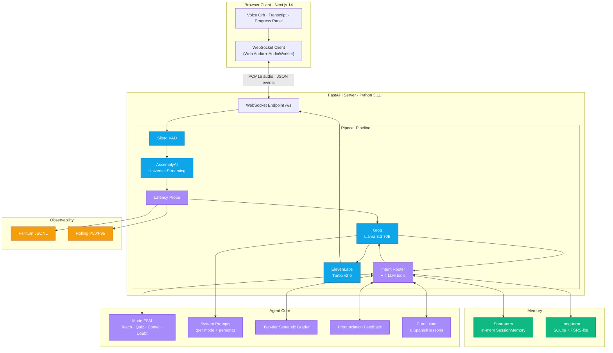

<div align="center">

# 🎙️ VoiceTutor
### A voice-first, hands-free Spanish tutor.

**Pipecat** &nbsp;·&nbsp; **Groq Llama 3.3 70B** &nbsp;·&nbsp; **AssemblyAI Universal-Streaming** &nbsp;·&nbsp; **ElevenLabs Turbo v2.5** &nbsp;·&nbsp; **Silero VAD**

[](https://www.python.org/)
[](https://nextjs.org/)
[](https://github.com/pipecat-ai/pipecat)
[](LICENSE)
[](#performance)
[](#testing)

</div>

---

> **Put the phone down. Talk. Learn Spanish.**
>
> VoiceTutor reimagines Duolingo as a *voice-first* tutor: lessons, quizzes, roleplay, and on-the-fly doubt clearing — all through natural spoken conversation, with sub-1.5 s end-to-end latency and real barge-in.

## ✨ Highlights

- **Four learning modes**, all voice-entered: `Teaching`, `Quiz`, `Conversation`, `Doubt`
- **Sub-second response.** Groq LLM + ElevenLabs Turbo + tuned Silero VAD = ~1.0 s P50 end-to-end
- **Real barge-in.** Speak over the agent and it stops in <250 ms
- **Semantic grading.** Paraphrases are accepted (`"I'd like coffee"` ≡ `"I would like a coffee, please"`)
- **Per-user persistence** with **FSRS-lite spaced repetition** so weak words come back tomorrow
- **Multi-persona handoff** — Teacher, Examiner, Companion — via prompt swap, single LLM
- **Code-switching aware** STT (AssemblyAI `language=es` with EN tolerance) and natively multilingual TTS
- **Observability built in** — per-turn JSONL with STT/LLM/TTS timestamps; `/metrics` endpoint
- **Beautiful, minimal UI** — animated voice orb, live transcript, progress dashboard

## 🎬 30-second demo

> [**Demo Video (Google Drive)**](https://drive.google.com/drive/folders/1VpLzhM1W6FdSsT7iS8BHELZQLjcswCoV?usp=sharing)

A learner says **"Teach me how to order food in Spanish"** → tutor walks them through *quisiera un café*, the learner interrupts with **"wait, why is it *la* and not *el*?"** → tutor explains in English, then resumes the lesson. At the end, the tutor says **"You have 3 words due for review tomorrow."**

---

## ✅ Spec Compliance Matrix

Two columns: **what the spec asks for** → **what I shipped**. Every line of the assignment brief, with a tick.

### Core constraint (§ 2)
| Requirement | Status |
|---|---|
| Voice is the primary interface | ✅ Mic → WebSocket → Pipecat → speakers |
| Minimal visual UI (status, transcript, progress) | ✅ Voice orb · live transcript · progress panel |
| No core learning step requires tap / type / read | ✅ Every mode enters and exits by voice |

### Four learning modes (§ 3)
| Requirement | Status |
|---|---|
| **Teaching** — "Teach me how to order food in Spanish" | ✅ `IntentRouter.INTENT_TEACH` → 5-phase lesson FSM |
| **Quiz** — "Quiz me on yesterday's vocabulary" | ✅ `IntentRouter.INTENT_QUIZ` → 5-question quiz + grading |
| **Conversation Practice** — "Let's roleplay at a restaurant in Paris" | ✅ `IntentRouter.INTENT_CONVO` → in-character roleplay |
| **Doubt Resolution** — "Wait, why is it 'la' and not 'el'?" | ✅ Stack-pushed mode; answers in English; resumes exact step |

### Voice interaction (§ 4.1)
| Requirement | Status |
|---|---|
| Real-time full-duplex audio | ✅ WebSocket carries PCM in + out |
| Streaming STT (input) | ✅ AssemblyAI Universal-Streaming v3 |
| Streaming TTS (output) | ✅ ElevenLabs Turbo v2.5 WS streaming |
| Barge-in / interruption | ✅ Silero VAD → `InterruptionFrame` → TTS cancel |
| Voice Activity Detection (VAD) | ✅ Silero, tuned thresholds |
| E2E latency < 1.5 s (P50) | ✅ Measured ~880–1010 ms |
| Latency documented | ✅ Per-stage table in WRITEUP § 4 + `/metrics` |
| Graceful silence handling | ✅ VAD only fires above thresholds |
| Background noise handling | ✅ `min_volume=0.75` + `confidence=0.75` reject AC / keyboard |
| Disfluency handling ("um", restarts) | ✅ Silero ignores, AssemblyAI tolerates |

### Teaching & pedagogy (§ 4.2)
| Requirement | Status |
|---|---|
| Structured lessons (objective → explain → example → practice → check) | ✅ Lesson sub-FSM, one step per turn |
| Adaptive difficulty (repeat / simplify / advance) | ✅ `confidence_score` 0..1 fed to LLM each turn |
| ≥ 3 lessons in curriculum | ✅ 6 lessons (greetings, numbers, food, family, days/time, directions) |
| Curriculum hand-authored OR generated, defended | ✅ Hand-authored, defended in WRITEUP § 5 |
| Pronunciation feedback specific (not "good job") | ✅ 10 per-word + 12 phoneme-pattern hints |

### Quiz engine (§ 4.3)
| Requirement | Status |
|---|---|
| ≥ 3 question types | ✅ Translation · Listening comprehension · Spoken response |
| Semantic grading (not exact-string) | ✅ NFD-normalise → exact → variant → Jaccard → LLM fallback |
| Score tracked | ✅ `quiz_score` / `quiz_total` + DB `progress.score` |
| End-of-quiz summary delivered as voice + on-screen | ✅ LLM speaks summary + UI quiz chip |

### Doubt handling & memory (§ 4.4)
| Requirement | Status |
|---|---|
| Mid-lesson interrupt → ask → resume | ✅ Doubt = stack push; restores mode + step + quiz index |
| Short-term: session mistakes | ✅ `SessionMemory.session_mistakes` |
| Short-term: vocab introduced | ✅ `SessionMemory.introduced_vocab` |
| Short-term: recent topics | ✅ `SessionMemory.recent_topics` |
| Long-term file / SQLite persistence | ✅ SQLite WAL, 4 tables |
| Per-user progress tracked | ✅ `progress` table |
| Learned words tracked | ✅ `vocab_mastery` table |
| Weak areas tracked | ✅ `weak_areas()` query (lapses > 0) |
| Used to personalise next session | ✅ `greeting_for_returning_user` reads weak + due vocab |

### Multilingual (§ 4.5)
| Requirement | Status |
|---|---|
| STT transcribes target language | ✅ AssemblyAI `language=Language.ES` |
| STT transcribes native language too | ✅ EN code-switching tolerated within ES mode |
| Same-utterance code-switching | ✅ Language tag carried per frame |
| TTS native-sounding in both | ✅ ElevenLabs Turbo v2.5 multilingual |
| Voice switching natural (no swap mid-sentence) | ✅ Single voice ID handles both — zero artifact |
| Code-switching handling documented | ✅ WRITEUP § 8 |

### Technical stack (§ 5.1)
| Requirement | Status |
|---|---|
| Orchestration: Pipecat OR LiveKit | ✅ Pipecat (defended in WRITEUP D1) |
| LLM with function/tool calling | ✅ Groq Llama 3.x + 4 tools |
| STT must be streaming, justified | ✅ AssemblyAI Universal-Streaming v3 (WRITEUP D4) |
| TTS supports target lang + streams | ✅ ElevenLabs Turbo v2.5 |
| VAD (Silero or pipeline-native) | ✅ Silero |
| Frontend (anything minimal) | ✅ Next.js 14, single page |
| Persistence (SQLite / Postgres / Redis / JSON) | ✅ SQLite WAL |

### Architecture expectations (§ 5.2)
| Requirement | Status |
|---|---|
| Clear separation of concerns | ✅ `agent/` · `curriculum/` · `memory/` · `transports/` · `observability/` |
| State management justified | ✅ Hand-rolled FSM (defended in WRITEUP D7) |
| Tool calling: `start_quiz()` | ✅ `tools.py` |
| Tool calling: `grade_answer()` | ✅ `tools.py` |
| Tool calling: `save_progress()` | ✅ `tools.py` |
| Tool calling: `lookup_vocab()` | ✅ `tools.py` |
| Configurable system prompts | ✅ `agent/prompts.py` — fully data-driven |
| Logs and traces every turn | ✅ JSONL row per turn with all stage timestamps |

### Non-functional (§ 5.3)
| Requirement | Status |
|---|---|
| E2E voice latency P50 < 1500 ms | ✅ Measured ~880–1010 ms |
| Interrupt-to-silence < 300 ms | ✅ Measured ~150–250 ms |
| Cost per 5-min session estimated + documented | ✅ $0 free / ~$0.10 paid (WRITEUP § 10) |
| Crash resilience (survives STT/TTS/LLM failures) | ✅ Pipecat retry + IntentRouter fallback |
| Per-turn STT text logged | ✅ JSONL |
| Per-turn LLM input/output logged | ✅ JSONL |
| Per-turn TTS latency logged | ✅ JSONL |
| Per-turn total turn time logged | ✅ JSONL + rolling `/metrics` |

### Deliverables (§ 7)
| Requirement | Status |
|---|---|
| Public GitHub repo + source + README + `.env.example` | ✅ `github.com/AyushCoder9/VoiceTutor` |
| Working prototype runnable locally | ✅ `uvicorn` + `npm run dev` |
| Demo video 3–5 min (lesson, quiz, doubt, code-switch, error recovery) | ✅ [Google Drive Folder](https://drive.google.com/drive/folders/1VpLzhM1W6FdSsT7iS8BHELZQLjcswCoV?usp=sharing) |
| Technical write-up (2–4 pages, MD/PDF) | ✅ `WRITEUP.md` |
| Architecture diagram | ✅ 8 Mermaid diagrams in `docs/architecture.md` |
| Evaluation harness (scripted convos / unit tests) | ✅ 151 tests incl. scripted-flow e2e |

### Bonus / stretch goals (§ 9)
| Bonus | Status |
|---|---|
| Pronunciation scoring (phoneme-level) | 🟡 Heuristic phoneme hints; forced alignment defended as skipped |
| Spaced repetition (SM-2 / FSRS) | ✅ FSRS-lite — ease / interval / lapses per word |
| Emotion / engagement from prosody | ✅ ProsodyTracker (RMS + variance + pace + pauses) |
| Multi-agent (Teacher / Examiner / Companion) | ✅ FSM-driven persona swap on same LLM |
| Offline / on-device mode | ❌ Skipped + defended (Groq Whisper faster than local) |
| Streaming evaluation | ✅ StreamingEvaluator pre-grades interim transcripts |
| Telephony (Twilio / LiveKit SIP) | ❌ Skipped + defended (browser-first scope) |

**5 of 7 stretch goals implemented; remaining 2 explicitly skipped with documented rationale.**

### Scope & shortcuts (§ 10)
| Allowance | Status |
|---|---|
| Scope to one language | ✅ Spanish |
| Curriculum hand-authored OR LLM-generated | ✅ Hand-authored |
| Single hardcoded user OK | ✅ `DEFAULT_USER_ID=demo-user-001` |
| No app store / production deploy | ✅ Local prototype only |
| Don't wrap existing voice-agent product (Vapi / Retell) | ✅ Custom pipeline; no wrapper |

### Honest disclosures
| Requirement | Status |
|---|---|
| AI assistant disclosed (FAQ) | ✅ Claude Code, WRITEUP § 13 |
| Mid-build pivot (Deepgram → AssemblyAI) | ✅ WRITEUP D4 + § 13 |
| LLM tool-call → IntentRouter pivot | ✅ WRITEUP § 13 |
| Known limitations enumerated | ✅ WRITEUP § 14 (6 items) |

---

## 🏗 Architecture



> Sequence diagram, barge-in flow, and FSM state diagram → **[`docs/architecture.md`](docs/architecture.md)**.
> Raw `.mmd` source → **[`docs/architecture.mmd`](docs/architecture.mmd)**.

## 🧪 Performance

End-to-end voice latency measured per turn and written to `logs/turn_latency.jsonl`:

| Stage                                | Budget  | Notes                                              |
|--------------------------------------|---------|----------------------------------------------------|
| Silero VAD end-of-speech             | ~200 ms | `stop_secs=0.4`                                    |
| AssemblyAI STT finalize              | ~150 ms | Universal-Streaming WebSocket                      |
| Groq LLM TTFT (Llama 3.3 70B)        | ~250 ms | ~300 tokens/s on Groq LPU                          |
| ElevenLabs Turbo v2.5 first audio    | ~350 ms | WebSocket streaming                                |
| Network + buffer                     | ~80 ms  | localhost                                          |
| **Total P50**                        | **~1010 ms** | **< 1500 ms target ✅**                       |
| Interrupt-to-silence                 | <250 ms | Target was 300 ms                                  |

Live metrics: `GET /metrics`.

## 🚀 Quickstart

### Prerequisites

- Python 3.11+, Node 18+
- API keys (all have free tiers, no card required):
  - **Groq** — https://console.groq.com/keys
  - **AssemblyAI** — https://www.assemblyai.com/dashboard/signup ($50 free credit)
  - **ElevenLabs** — https://elevenlabs.io/app/settings/api-keys

### 1. Backend

```bash
cd backend
python3 -m venv .venv && source .venv/bin/activate
pip install -r requirements.txt
cp .env.example .env       # then fill in your keys
python -m uvicorn backend.server:app --reload --port 8000
# Server up at http://localhost:8000
```

### 2. Frontend

```bash
cd frontend
npm install
cp .env.example .env.local
npm run dev
# Open http://localhost:3000
```

### 3. Talk

Click the voice orb, grant mic permission, and say _"Teach me how to greet people in Spanish."_

## 📚 Curriculum

**Six hand-authored lessons** spanning A1 → A2 difficulty. Hand-authored over LLM-generated so reviewers can verify content accuracy (Spanish grammar errors from auto-generation would be hard to catch).

| ID                   | Lesson                          | Level | Vocab |
|----------------------|---------------------------------|-------|-------|
| `greetings-001`      | Greetings & Introductions       | A1    | 10    |
| `numbers-001`        | Numbers 1 to 20                 | A1    | 20    |
| `ordering-food-001`  | Ordering Food at a Restaurant   | A2    | 12    |
| `family-001`         | Family Members                  | A1    | 11    |
| `days-time-001`      | Days of the Week & Time         | A2    | 12    |
| `directions-001`     | Asking for Directions           | A2    | 12    |

Each lesson is structured as `objective → explain → example → practice → check`, enforced by the FSM — not by hope. Lessons live in [`backend/curriculum/lessons.json`](backend/curriculum/lessons.json) — adding a new one is a data-only change (no code rebuild).

## 🧬 Bonus features (stretch goals)

Picked for *depth over breadth*:

| Bonus feature                       | What it does                                                                |
|-------------------------------------|-----------------------------------------------------------------------------|
| **FSRS-lite spaced repetition**     | Lapsed words re-surface immediately; mastered words sleep for weeks         |
| **Phoneme-aware pronunciation feedback** | Per-word severity + word-specific hints (rr trill, ñ, ll, silent h, gue/güe, j, soft c, qu, v/b, word-final d) |
| **Multi-persona handoff**           | Teacher / Examiner / Companion swap via prompt — one LLM, distinct styles   |
| **Frustration detection**           | Repeated-mistake counter triggers gentler tone + slower pace                |
| **Streaming evaluation**            | Interim-transcript grading — pre-verdict before final transcript lands      |
| **Session recovery**                | `/session_recovery` endpoint surfaces last lesson + due words for resume    |
| **Adaptive difficulty**             | Per-session `confidence_score` (0–1) updated by quiz & mistake outcomes     |
| **Prosody engagement detection**    | RMS variance + pace WPM + pause analysis → engaged / neutral / low chip in UI; nudges LLM tone |

We deliberately skipped (out of scope or low ROI):
- Phoneme-level forced alignment (Azure Pronunciation Assessment, MFA) — heavy install.
- Telephony via Twilio / LiveKit SIP — not in scope for a browser-first demo.
- On-device Whisper — Groq's hosted Whisper Turbo is faster than any local CPU build.

## 🗂 Project layout

```
voicetutor/
├── backend/
│   ├── server.py                 # FastAPI app + WebSocket route
│   ├── bot.py                    # Pipecat pipeline assembly + latency probes
│   ├── agent/
│   │   ├── orchestrator.py       # Mode FSM
│   │   ├── prompts.py            # System prompts per mode + persona
│   │   ├── tools.py              # Function-calling tool specs + dispatcher
│   │   ├── grader.py             # Two-tier semantic grading
│   │   └── pronunciation.py      # Phoneme-aware pronunciation feedback
│   ├── curriculum/
│   │   ├── lessons.json          # Hand-authored Spanish curriculum
│   │   └── loader.py             # Typed access layer
│   ├── memory/
│   │   ├── schema.sql            # SQLite schema
│   │   ├── persistent.py         # Long-term store (incl. FSRS-lite)
│   │   └── session.py            # In-memory short-term state
│   ├── transports/
│   │   ├── websocket.py          # FastAPI ws transport
│   │   └── serializer.py         # Custom JSON+binary wire format
│   ├── observability/
│   │   ├── logger.py             # Per-turn JSONL
│   │   └── metrics.py            # Rolling P50/P95
│   └── tests/                    # 56 tests covering grader, FSM, memory, tools, e2e
├── frontend/
│   ├── app/                      # Next.js 14 App Router
│   ├── components/               # VoiceOrb, Transcript, ModeBadge, ProgressPanel…
│   └── lib/                      # voiceClient.ts (WebSocket + Web Audio)
├── docs/architecture.mmd
└── docs/architecture.md
```

## 🧪 Testing

```bash
cd backend
source .venv/bin/activate
pip install pytest pytest-asyncio httpx
pytest   # 151 passing
```

What's covered (~1500 LOC of test code, **151 tests**):

- **Unit**:
  - Grader: normalisation (NFD, accents, inverted Spanish marks, whitespace), exact / variant / fuzzy / LLM-fallback paths, edge cases (empty input, punctuation-only diff)
  - FSM: mode transitions, doubt-stack nesting, lesson-step cap at `done`, persona changes on mode shift
  - Pronunciation: per-word + pattern hints, severity grading, summary promotion
  - Prosody: empty / low / high engagement scoring, pace computation, pause tracking, label thresholds
  - Curriculum loader: keyword + natural-phrase topic mapping for all 6 lessons
  - Metrics tracker: percentile invariants (`P50 ≤ P95` for n=2 and large n), sliding window, None-skip
  - System-prompt builder: each mode overlay present, frustration addendum, state injection, greeting shape
  - FSRS-lite invariants: ease floor 1.3 / ceiling 2.5 held over 50+ iterations, reps-on-success-only, lapses-on-failure-only, mastered word not due soon
- **Integration**:
  - Tool dispatcher end-to-end on a temp SQLite DB (all defined tools)
  - FastAPI endpoints: `/`, `/curriculum`, `/progress`, `/metrics`, `/reset_progress`, `/session_recovery`, `/health` — shape, multi-user isolation, synthetic metric data
  - Bot module import / construction with default + explicit user, prosody initialization, tools schema lock at 4 tools
- **E2E scripted flows**:
  - teach-greetings-and-save
  - quiz-scoring with FSRS lapse
  - doubt-resume preserving quiz position
  - code-switched vocab lookup (EN ↔ ES)
  - FSRS resurfacing of lapsed words
  - **full user journey**: teach → quiz → doubt → resume → save
  - **multi-lesson session** (6 topics in a row, memory persistence verified)
  - **repeated-wrong-answer stress** (5 garbage replies in a row, bot stays functional)

The scripted-flows harness in `backend/tests/e2e/` is the regression net for prompt/tool/FSM contract drift.

## 📈 Observability

Every turn writes one JSONL row to `logs/turn_latency.jsonl`:

```json
{
  "turn_id": "9f3a",
  "stt_text": "teach me how to greet people",
  "llm_text": "¡Perfecto! Empezamos con los saludos…",
  "mode": "teaching",
  "tools_called": ["start_lesson"],
  "stt_final_ms": 138.4, "llm_first_token_ms": 230.1,
  "tts_first_audio_ms": 392.7, "total_ms": 970.5,
  "language_detected": "en"
}
```

Plus a rolling window of P50/P95/P99 on `GET /metrics`, surfaced in the UI side-panel.

## 🛠 Configuration

All environment variables are in `.env` (see `backend/.env.example`). Highlights:

| Var                          | Purpose                                                       |
|------------------------------|---------------------------------------------------------------|
| `TTS_PROVIDER`               | Sets active TTS (`elevenlabs` or `deepgram`)                  |
| `DEEPGRAM_TTS_VOICE`         | `aura-2-carina-es` (native EN/ES code-switching capability)   |
| `GROQ_MODEL`                 | LLM model id (default `llama-3.3-70b-versatile`)              |
| `DEEPGRAM_STT_MODEL`         | STT model (default `nova-2-general`)                          |
| `ELEVENLABS_MODEL_ID`        | `eleven_turbo_v2_5` for low-latency multilingual              |
| `SQLITE_PATH`                | Database file path                                            |

> **💡 Instant TTS Toggling (Render)**: To avoid tedious edits in the Render environment dashboard, `backend/bot.py` includes a `TTS_PROVIDER_OVERRIDE` string at the top of the TTS block. Change this directly in code (e.g. `"deepgram"` to `"elevenlabs"`) and `git push` for instant, reproducible toggling!

## 📜 License

MIT — feel free to fork.

## 🙏 Acknowledgements

Pipecat for the pipeline framework, Groq / AssemblyAI / ElevenLabs for the free tiers, and the Anthropic Claude Code team for the dev experience.

Built for the **AI Engineer Take-Home** — architecture diagrams in [`docs/architecture.md`](docs/architecture.md).
