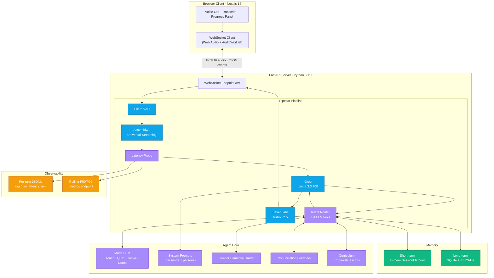
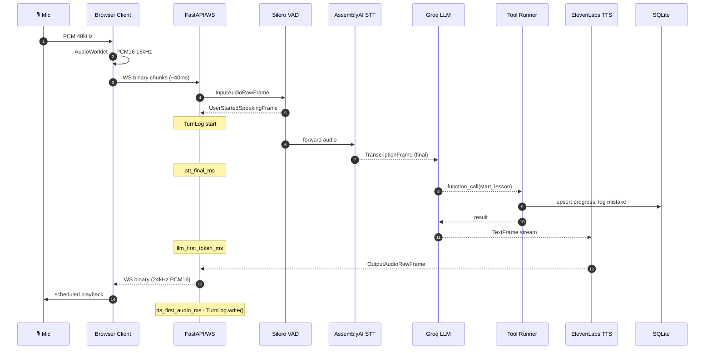
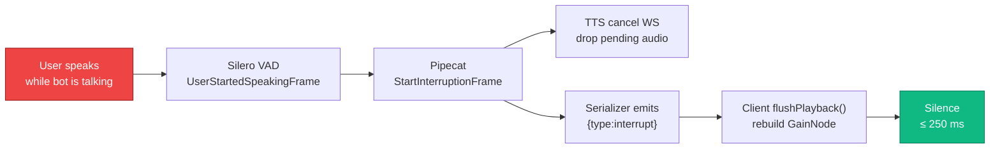
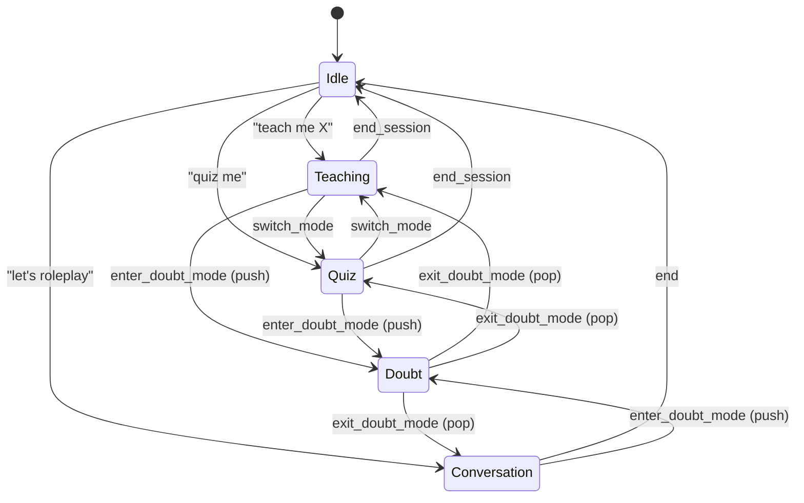
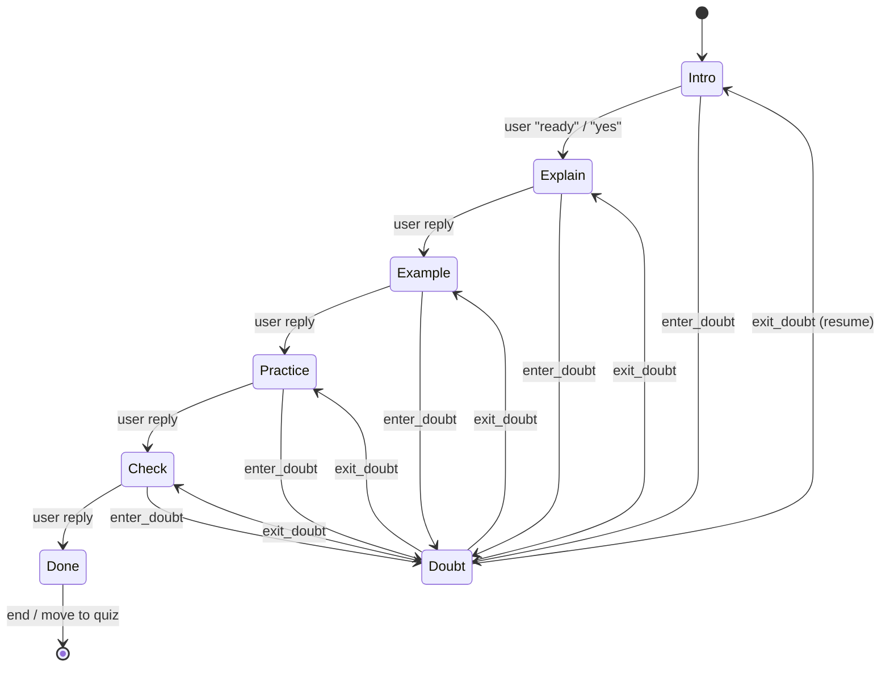
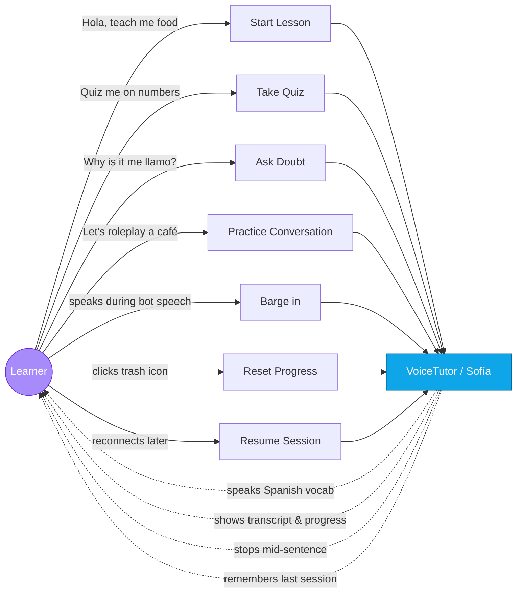
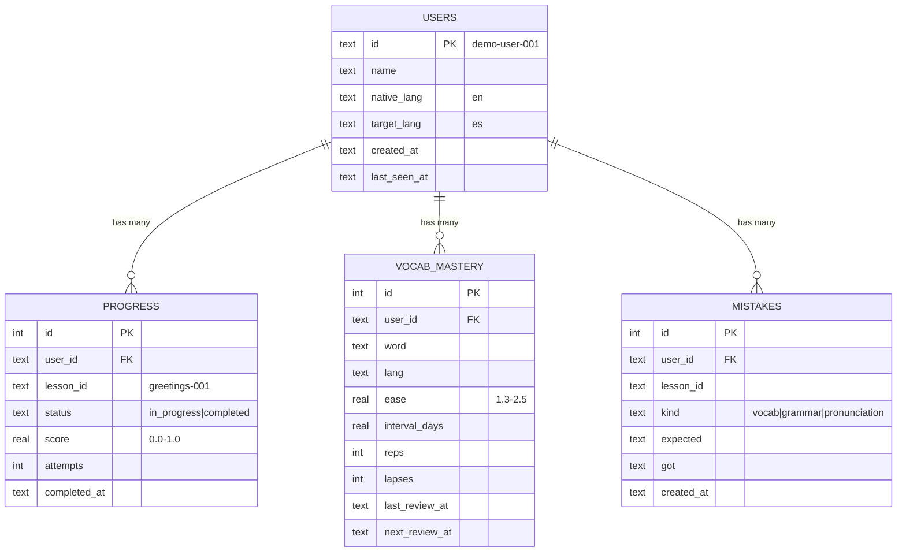
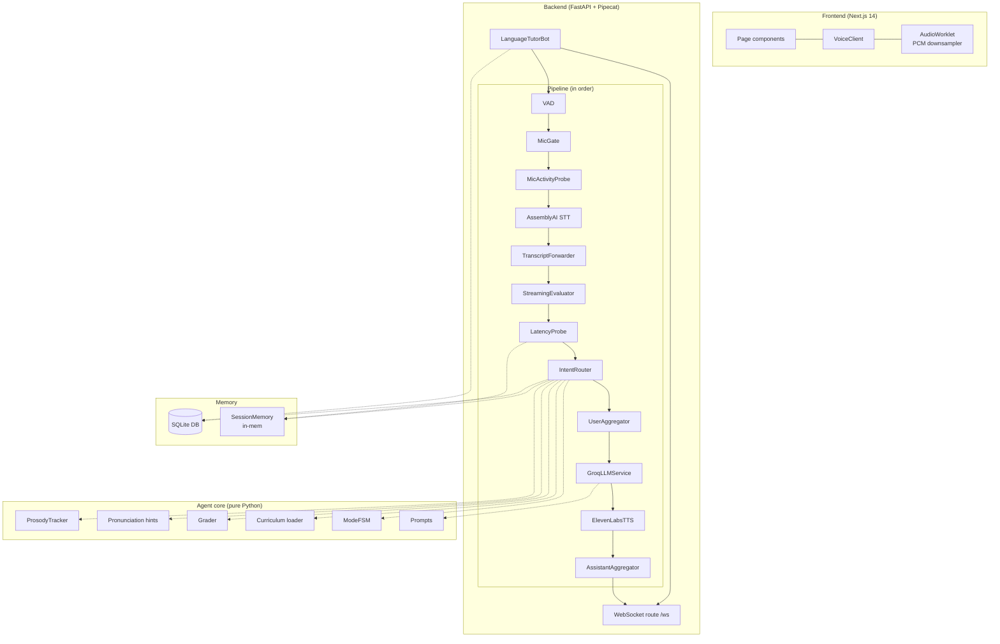

# VoiceTutor — Architecture

GitHub renders the Mermaid block below natively. For the raw source (also editable in `mermaid.live` or `mmdc`), see [`architecture.mmd`](./architecture.mmd).

## High-level system

## Turn lifecycle (sequence)

## Barge-in flow

## Mode FSM

## Lesson sub-state machine (within Teaching mode)

## Use cases (actor & system view)

## Data model (entity-relationship)

## Component diagram

